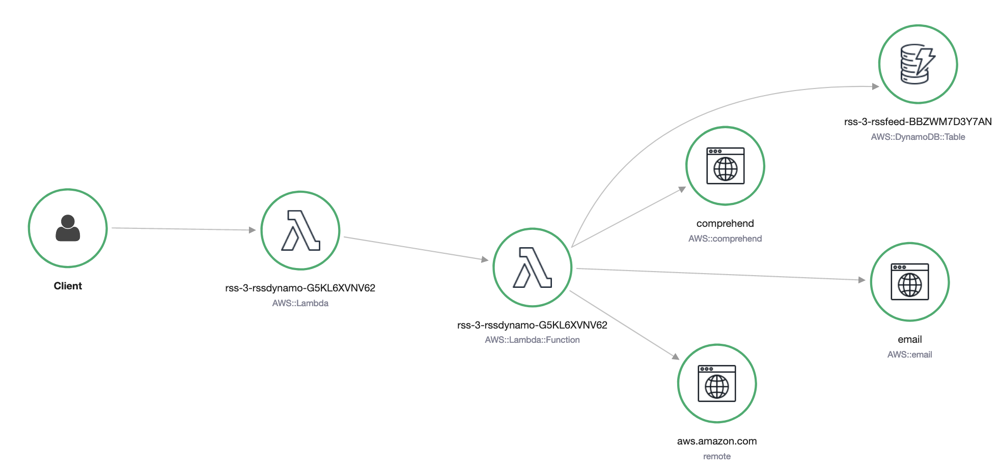
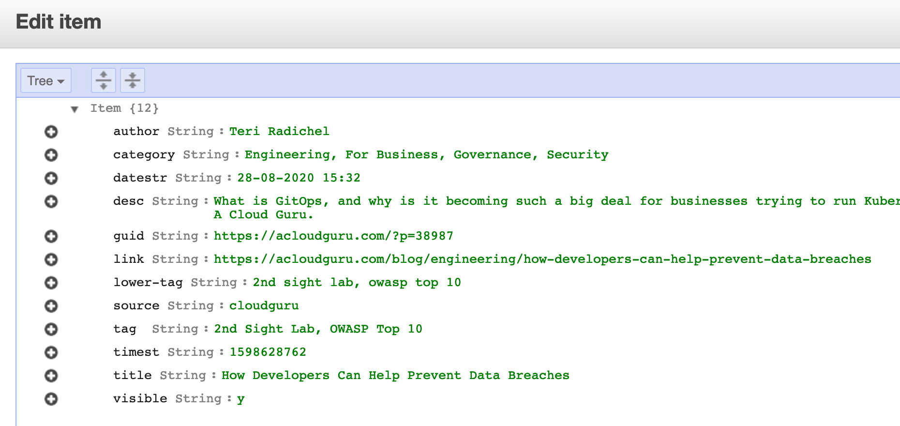
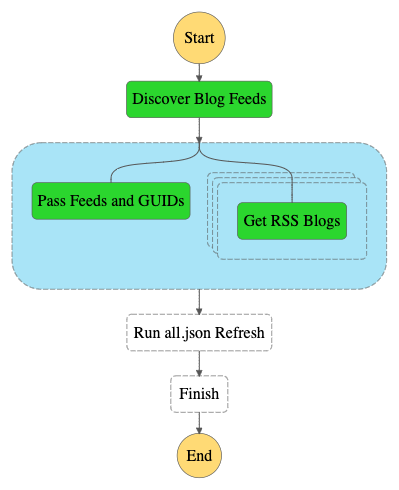

rss-lambda
==========

Monitor blogs through RSS and store new posts in DynamoDB. The workflow can also send notifications through Amazon SES, refresh JSON feeds in S3, and expose the stored posts through an optional AppSync API. A Standard Step Functions workflow runs every 15 minutes by default.

The default feed list includes AWS, Google, and Wiz security feeds. Add or remove feeds in `lambda-crawl/feeds.txt`; each line contains a source name and RSS URL separated by a comma.

The feed retrieval Lambda uses `readability-lxml` to extract article content. It stores the title, description, metadata, cleaned text, and source HTML in DynamoDB. When a new article is found, the workflow also refreshes the source JSON file and the combined `all.json` file in the S3 bucket.

The DynamoDB table stores each article's metadata and extracted content. The larger HTML and text fields are omitted from the diagram.

The Step Functions workflow coordinates feed discovery, parallel feed retrieval, and the combined JSON refresh.

Installation
------------

- Install and configure the AWS SAM CLI, Docker, and AWS credentials for the target account.
- Edit `lambda-crawl/feeds.txt` if you want to change the monitored feeds.
- Run `make init` for the first deployment. SAM will prompt for the stack name, region, and parameter values, then save them in the ignored `samconfig.toml` file.
- Run `make deploy` for subsequent deployments.

The template parameters are:

- `SourceEmail`: SES-verified sender address.
- `DestEmail`: notification recipient address.
- `SendEmails`: set to `y` to enable notifications or `n` to disable them.
- `CreateAppSync`: set to `y` to create the read-only AppSync API or `n` to skip it.

SES sender and recipient addresses must be verified in the AWS account. The Step Functions console URL is exposed as the `StateMachineURL` CloudFormation output.

Repository contents
-------------------

- `template.yaml` is the SAM/CloudFormation deployment source.
- `gitsync-deployment.yaml` contains the production parameters and tags used by CloudFormation Git sync.
- `lambda-crawl/` contains the function that discovers feeds and determines the retrieval window.
- `lambda-getfeed/` contains the function that retrieves and stores individual feed entries.
- `lambda-pagecount/` contains the manually invoked counter-refresh function.
- `statemachine/` contains the Standard Step Functions definition.
- `lambda-layer/` contains the shared Python dependency list for the feed retrieval functions.
- `graphql/` contains the AppSync schema and VTL resolver templates used as source/reference files.
- `docs/` contains architecture and data-flow diagrams.

License
-------

MIT-0, please see the `LICENSE` file.

Contact
-------

For questions or bugs, please raise an issue or reach out to @marekq.
